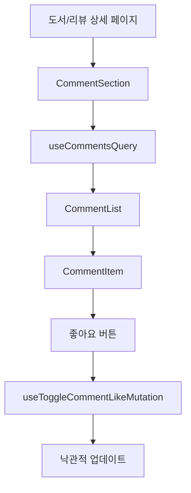

# Frontend Feature: Comment

프론트엔드의 `comment` 기능은 도서와 리뷰에 대한 댓글 작성, 조회, 수정, 삭제 및 좋아요 기능을 담당합니다.

## 1. 주요 파일 및 역할

- **`apis.ts`**: 백엔드 `/comments` 엔드포인트와 통신하는 API 함수들을 정의합니다.
  - `getComments`: 특정 대상(도서/리뷰)의 댓글 목록 조회
  - `getMyComments`: 내가 작성한 댓글 목록 조회
  - `createComment`: 댓글 작성
  - `updateComment`: 댓글 수정
  - `deleteComment`: 댓글 삭제
  - `toggleCommentLike`: 댓글 좋아요 토글

- **`queries.tsx`**: TanStack Query 쿼리 훅을 정의합니다.
  - `useCommentsQuery`: 댓글 목록 조회 훅 (페이지네이션)
  - `useMyCommentsQuery`: 내가 작성한 댓글 목록 조회 훅

- **`mutations.tsx`**: TanStack Query 뮤테이션 훅을 정의합니다.
  - `useCreateCommentMutation`: 댓글 작성
  - `useUpdateCommentMutation`: 댓글 수정
  - `useDeleteCommentMutation`: 댓글 삭제
  - `useToggleCommentLikeMutation`: 댓글 좋아요 토글 (낙관적 업데이트 적용)

- **`components/`**: 댓글 관련 UI 컴포넌트들
  - `comment-section.tsx`: 댓글 섹션 컨테이너
  - `comment-list.tsx`: 댓글 목록
  - `comment-item.tsx`: 개별 댓글 아이템
  - `comment-form.tsx`: 댓글 작성/수정 폼

- **`types.ts`**: 댓글 관련 TypeScript 타입 정의
- **`constants.ts`**: 댓글 관련 상수 (타겟 타입 등)

## 2. 데이터 흐름

## 3. 낙관적 업데이트

좋아요 토글 시 빠른 UI 반응을 위해 낙관적 업데이트를 적용했습니다:

1. 사용자가 좋아요 버튼 클릭
2. `onMutate`: 캐시된 댓글 데이터의 `isLiked`와 `likeCount` 즉시 업데이트
3. 서버 요청 진행
4. 성공/실패에 따라 데이터 동기화 또는 롤백
