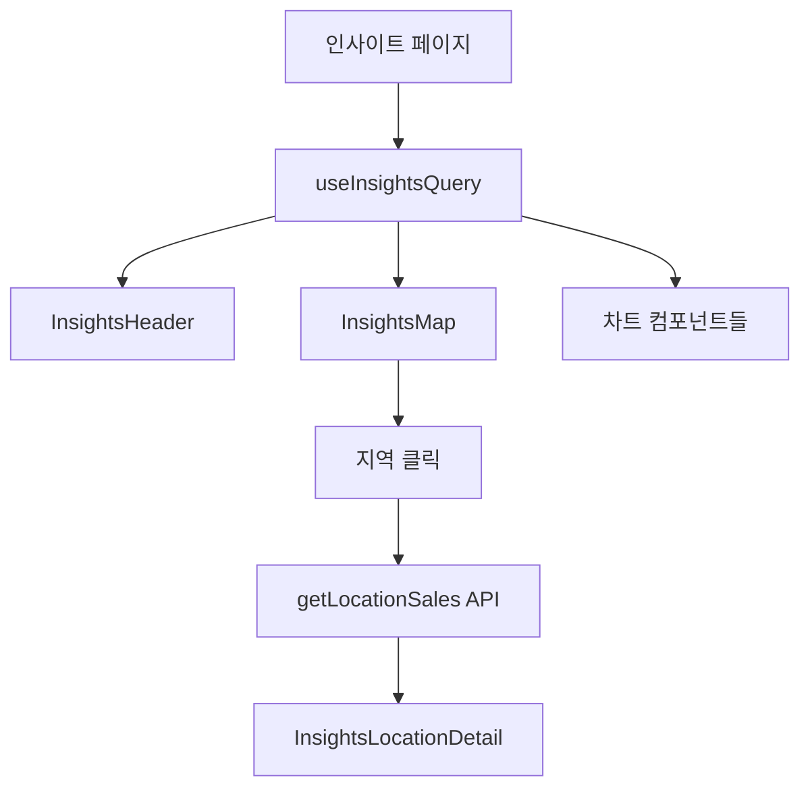

# Frontend Feature: Insights

프론트엔드의 `insights` 기능은 bookjeok 서비스의 전체 통계와 인사이트 데이터를 시각적으로 표현하는 대시보드를 제공합니다.

## 1. 주요 파일 및 역할

- **`apis.ts`**: 백엔드 `/insights` 엔드포인트와 통신하는 API 함수들을 정의합니다.
  - `getInsights`: 전체 인사이트 데이터 조회
  - `getLocationSales`: 특정 지역 판매글 조회

- **`queries.tsx`**: TanStack Query 쿼리 훅을 정의합니다.
  - `useInsightsQuery`: 인사이트 데이터 조회 훅

- **`components/`**: 인사이트 관련 UI 컴포넌트들
  - `insights-header.tsx`: 대시보드 헤더 (요약 통계)
  - `insights-map.tsx`: 지역별 거래 현황 지도
  - `insights-category-chart.tsx`: 카테고리별 리뷰 분포 차트
  - `insights-price-chart.tsx`: 가격대별 판매글 분포 차트
  - `insights-activity-chart.tsx`: 최근 30일 활동 추이 차트
  - `insights-reaction-chart.tsx`: 리액션 타입별 분포 차트
  - `insights-popular-tags.tsx`: 인기 태그 클라우드
  - `insights-location-detail.tsx`: 지역별 상세 판매글 목록

- **`types.ts`**: 인사이트 관련 TypeScript 타입 정의
- **`constants.ts`**: 차트 색상, 레이블 등 상수 정의

## 2. 주요 컴포넌트

### 인사이트 헤더 (`insights-header.tsx`)

서비스 전체 요약 통계를 카드 형태로 표시:

- 전체 판매글 수
- 전체 리뷰 수
- 전체 리액션 수
- 전체 태그 수

### 지역별 거래 현황 지도 (`insights-map.tsx`)

지역별 중고 거래 현황을 지도에 시각화:

- 클러스터 마커로 지역별 거래량 표시
- 클릭 시 해당 지역 판매글 목록 표시
- 지도 API 연동 (네이버/카카오 맵)

### 차트 컴포넌트들

다양한 통계를 차트로 시각화:

- **카테고리 차트**: 리뷰 카테고리별 분포 (파이 차트)
- **가격 차트**: 가격대별 판매글 분포 (막대 차트)
- **활동 추이 차트**: 최근 30일 일별 활동 (라인 차트)
- **리액션 차트**: 리액션 타입별 분포 (도넛 차트)

## 3. 데이터 흐름

## 4. 캐싱 전략

인사이트 데이터는 빈번하게 변경되지 않으므로 긴 캐시 시간을 적용:

- `staleTime`: 5분
- `cacheTime`: 30분

이를 통해 불필요한 API 호출을 줄이고 빠른 페이지 로딩을 제공합니다.
