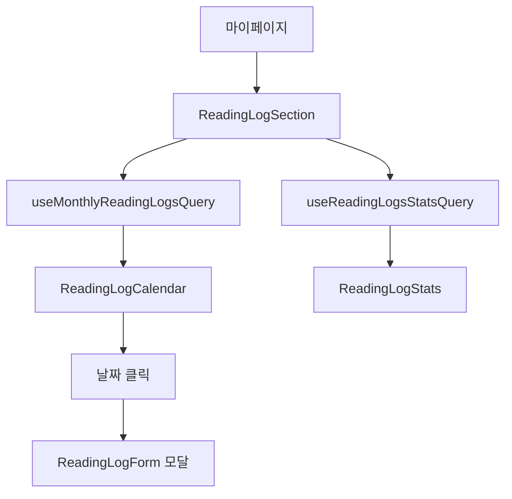

# Frontend Feature: Reading-Log

프론트엔드의 `reading-log` 기능은 사용자의 독서 기록을 관리하고 시각화하는 역할을 담당합니다. 캘린더 뷰, 통계, 타임라인 등 다양한 UI를 제공합니다.

## 1. 주요 파일 및 역할

- **`apis/index.ts`**: 백엔드 `/reading-logs` 엔드포인트와 통신하는 API 함수들을 정의합니다.

- **`queries.ts`**: TanStack Query 쿼리/뮤테이션 훅을 정의합니다.
  - `useMonthlyReadingLogsQuery`: 월별 독서 기록 조회
  - `useInfiniteReadingLogsQuery`: 무한 스크롤 독서 기록 조회
  - `useReadingLogsStatsQuery`: 독서 통계 조회
  - `useReadingLogSettingsQuery`: 공개 설정 조회
  - `useCreateReadingLogMutation`: 독서 기록 생성
  - `useUpdateReadingLogMutation`: 독서 기록 수정
  - `useDeleteReadingLogMutation`: 독서 기록 삭제
  - `useUpdateReadingLogSettingsMutation`: 공개 설정 수정

- **`components/`**: 독서 기록 관련 UI 컴포넌트들
  - `reading-log-calendar.tsx`: 캘린더 형태로 독서 기록 표시
  - `reading-log-timeline.tsx`: 타임라인 형태로 독서 기록 표시
  - `reading-log-stats.tsx`: 월별/연간 독서 통계 표시
  - `reading-log-form.tsx`: 독서 기록 추가/수정 폼
  - `reading-log-item.tsx`: 개별 독서 기록 아이템
  - `reading-log-settings.tsx`: 공개 설정 UI

- **`hooks/`**: 커스텀 훅
  - `use-reading-log-calendar.ts`: 캘린더 날짜 네비게이션 로직

- **`types.ts`**: 독서 기록 관련 TypeScript 타입 정의
- **`constants.ts`**: 요일명, 월명 등 상수 정의

## 2. 주요 컴포넌트

### 캘린더 뷰 (`reading-log-calendar.tsx`)

월별 독서 현황을 캘린더 형태로 시각화합니다:

- 날짜별 독서 기록 표시
- 클릭 시 해당 날짜 기록 상세 보기
- 월 네비게이션 (이전/다음 달)

### 타임라인 뷰 (`reading-log-timeline.tsx`)

공개 프로필에서 사용되는 타임라인 형태의 독서 기록:

- 최근 3개월 독서 기록 표시
- 도서 표지, 제목, 날짜 표시

### 독서 통계 (`reading-log-stats.tsx`)

사용자의 독서 현황을 숫자로 표시:

- 이번 달 읽은 책 수
- 올해 읽은 책 수

## 3. 데이터 흐름

## 4. 공개 설정

사용자는 자신의 독서 기록을 다른 사용자에게 공개할지 설정할 수 있습니다:

- 공개: 프로필 페이지에서 최근 3개월 독서 기록이 타임라인으로 표시
- 비공개: 본인만 열람 가능
