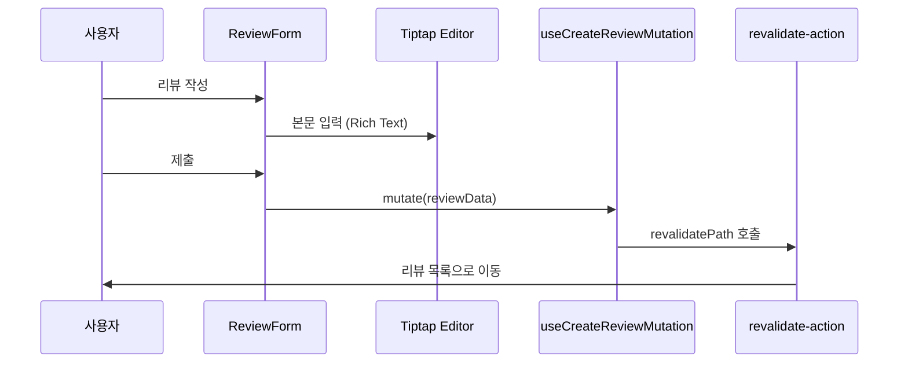

# Frontend Feature: Review

프론트엔드의 `review` 기능은 도서 리뷰 작성, 조회, 수정, 삭제 및 리액션 기능을 담당합니다. 인기 리뷰 랭킹, 카테고리별 필터링 등 다양한 기능을 제공합니다.

## 1. 주요 파일 및 역할

- **`apis.ts`**: 백엔드 `/reviews` 엔드포인트와 통신하는 API 함수들을 정의합니다.
  - `getReviews`: 리뷰 목록 조회 (필터링/페이지네이션)
  - `getReviewDetail`: 리뷰 상세 조회
  - `getPopularReviews`: 인기 리뷰 목록 조회
  - `getReviewFeeds`: 카테고리별 리뷰 피드 조회
  - `createReview`: 리뷰 작성
  - `updateReview`: 리뷰 수정
  - `deleteReview`: 리뷰 삭제
  - `toggleReaction`: 리액션 토글
  - `getMyReaction`: 내 리액션 상태 조회

- **`queries.tsx`**: TanStack Query 쿼리 훅을 정의합니다.
  - `useReviewDetailQuery`: 리뷰 상세 조회
  - `useReviewsQuery`: 리뷰 목록 조회
  - `usePopularReviewsQuery`: 인기 리뷰 조회
  - `useReviewFeedsQuery`: 카테고리별 피드 조회
  - `useMyReactionQuery`: 내 리액션 상태 조회

- **`mutations.tsx`**: TanStack Query 뮤테이션 훅을 정의합니다.
  - `useCreateReviewMutation`: 리뷰 작성
  - `useUpdateReviewMutation`: 리뷰 수정
  - `useDeleteReviewMutation`: 리뷰 삭제
  - `useToggleReactionMutation`: 리액션 토글 (낙관적 업데이트)

- **`components/`**: 리뷰 관련 UI 컴포넌트들
  - `review-card.tsx`: 리뷰 카드 (목록용)
  - `review-detail.tsx`: 리뷰 상세 화면
  - `review-form.tsx`: 리뷰 작성/수정 폼
  - `review-reaction-section.tsx`: 리액션 버튼 섹션
  - `review-slider.tsx`: 홈페이지 리뷰 슬라이더
  - `popular-review-list.tsx`: 인기 리뷰 랭킹 목록

- **`actions/`**: 서버 액션
  - `revalidate-action.ts`: 리뷰 관련 캐시 무효화

- **`server/`**: 서버 사이드 데이터 페칭
- **`types/`**: 리뷰 관련 TypeScript 타입 정의
- **`constants.ts`**: 리뷰 카테고리, 리액션 타입 등 상수 정의
- **`schemas.ts`**: Zod 스키마 (폼 유효성 검사)

## 2. 리뷰 작성 플로우

## 3. 리액션 시스템

리뷰에는 다양한 리액션을 남길 수 있습니다:

- 👍 좋아요
- 💡 유익해요
- 💪 응원해요
- 😢 공감해요
- 🎉 축하해요

각 리액션은 토글 방식으로 동작하며, 낙관적 업데이트를 적용하여 빠른 UI 반응성을 제공합니다.

## 4. 인기 리뷰 선정

인기 리뷰는 다음 공식으로 계산됩니다:

- 스코어 = (조회수 × 1) + (리액션 수 × 3)

홈페이지와 리뷰 목록 페이지에서 인기 리뷰 랭킹을 확인할 수 있습니다.

## 5. Tiptap 에디터

리뷰 본문 작성에 Tiptap 에디터를 사용합니다:

- 서식 지정 (굵게, 기울임, 밑줄)
- 제목 (H1, H2, H3)
- 목록 (순서 있음/없음)
- 인용구
