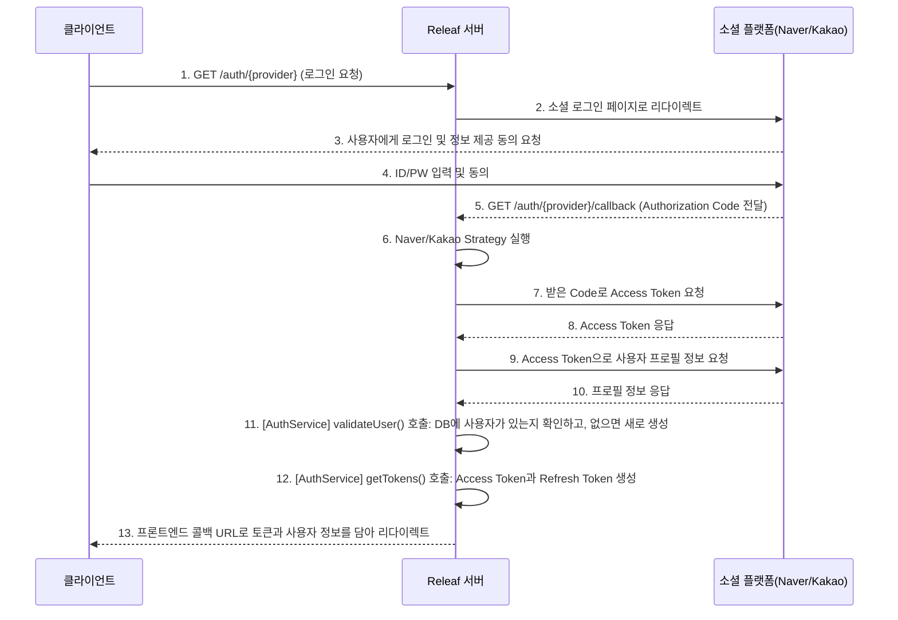
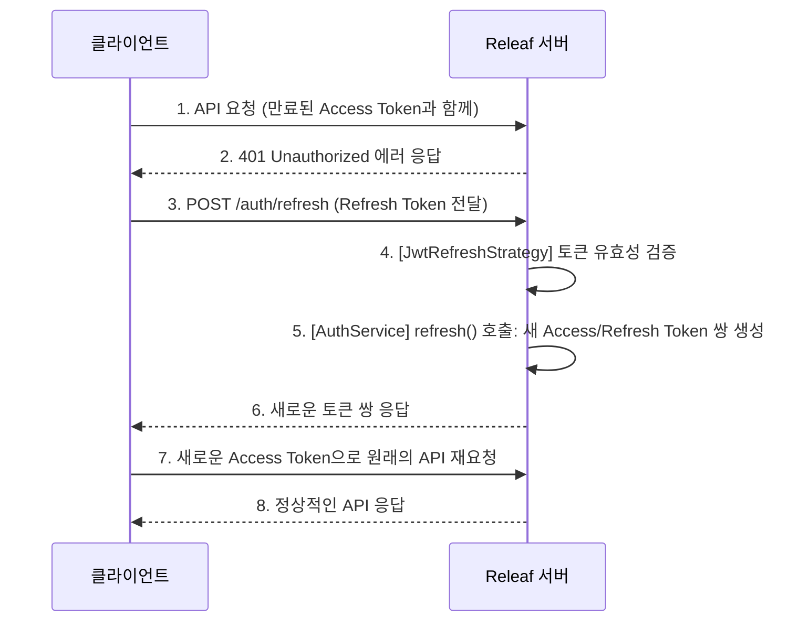

# Auth Module (`features/auth`)

`AuthModule`은 사용자 인증 및 권한 부여와 관련된 모든 기능을 담당하는 핵심 모듈입니다. 소셜 로그인(네이버, 카카오) 처리, JWT(JSON Web Token) 기반의 인증 시스템, 라우트 보호를 위한 가드(Guard) 기능 등을 제공합니다.

## 1. 주요 파일 및 역할

- **`auth.controller.ts`**: HTTP 요청을 수신하는 컨트롤러입니다. 소셜 로그인 시작, 콜백 처리, 토큰 갱신 등 `/auth` 경로의 API 엔드포인트를 정의합니다.
- **`auth.service.ts`**: 실제 비즈니스 로직을 수행하는 서비스입니다. 소셜 로그인으로 얻은 사용자 정보를 검증하고, 서비스 전용 Access Token과 Refresh Token을 발급하는 역할을 합니다.
- **`strategies/`**: Passport.js의 인증 전략을 정의하는 파일들이 위치합니다.
  - `naver.strategy.ts`: 네이버 OAuth 2.0 인증 로직을 처리합니다.
  - `kakao.strategy.ts`: 카카오 OAuth 2.0 인증 로직을 처리합니다.
  - `jwt.strategy.ts`: Access Token의 유효성을 검증하여 API 요청을 인가합니다.
  - `jwt-refresh.strategy.ts`: Refresh Token의 유효성을 검증하여 새로운 Access Token을 발급하는 데 사용됩니다.
- **`guards/`**: 요청을 처리하기 전에 특정 조건을 만족하는지 검사하는 가드입니다. (현재 파일은 없으나, `JwtAuthGuard` 등이 여기에 위치할 수 있습니다.)
- **`decorators/`**: 컨트롤러에서 사용자 정의 데코레이터를 사용할 수 있도록 합니다. (e.g., `@CurrentUser`)
- **`dtos/`**: 데이터 전송 계층(Data Transfer Objects)으로, 클라이언트와 서버 간 데이터 교환 형식을 정의합니다.
- **`types/`**: 모듈 내에서 사용되는 타입 정의가 위치합니다. (e.g., `JwtPayload`)

## 2. API 엔드포인트

| HTTP Method | 경로 (`/auth/...`) | 설명                                     | 인증 필요          |
| :---------- | :----------------- | :--------------------------------------- | :----------------- |
| `GET`       | `/naver`           | 네이버 소셜 로그인을 시작합니다.         | ❌                 |
| `GET`       | `/naver/callback`  | 네이버 로그인 성공 후 콜백을 처리합니다. | ❌                 |
| `GET`       | `/kakao`           | 카카오 소셜 로그인을 시작합니다.         | ❌                 |
| `GET`       | `/kakao/callback`  | 카카오 로그인 성공 후 콜백을 처리합니다. | ❌                 |
| `POST`      | `/refresh`         | Access Token을 재발급합니다.             | ✅ (Refresh Token) |

## 3. 핵심 로직 흐름

### 소셜 로그인 및 JWT 발급

Releaf의 인증은 OAuth 2.0과 JWT를 결합한 방식입니다. 사용자는 소셜 플랫폼(네이버/카카오)을 통해 인증하고, Releaf 서버는 이 정보를 바탕으로 자체적인 JWT를 발급하여 클라이언트에게 전달합니다.

1.  **로그인 시작**: 클라이언트가 `GET /auth/naver` 또는 `GET /auth/kakao`를 호출하여 로그인을 시작합니다.
2.  **소셜 플랫폼 인증**: 서버는 사용자를 해당 소셜 플랫폼의 로그인 페이지로 리다이렉트하고, 사용자는 로그인을 완료합니다.
3.  **콜백 처리**: 로그인이 성공하면 소셜 플랫폼은 지정된 콜백 URL(`GET /auth/{provider}/callback`)로 `Authorization Code`와 함께 리다이렉트합니다.
4.  **사용자 검증 및 토큰 발급**:
    - `NaverStrategy` 또는 `KakaoStrategy`가 실행되어 `Code`를 사용해 소셜 플랫폼으로부터 **Access Token**을 발급받습니다.
    - 발급받은 토큰으로 사용자 프로필 정보를 조회합니다.
    - `AuthService.validateUser()`가 호출되어 프로필 정보(provider, providerId)를 기준으로 우리 서비스 DB에 이미 가입된 사용자인지 확인하고, 없다면 새로 등록합니다.
    - `AuthService.getTokens()`가 호출되어 Releaf 서비스 전용 **Access Token**과 **Refresh Token**을 생성합니다.
5.  **클라이언트 전달**: 서버는 발급된 토큰과 사용자 정보를 쿼리 파라미터에 담아 프론트엔드의 콜백 페이지로 리다이렉트합니다. 프론트엔드는 이 정보를 받아 저장하고 로그인 상태를 관리합니다.

### Access Token 갱신

Access Token은 수명이 짧아(예: 15분) 만료될 수 있습니다. 이 경우, 클라이언트는 만료되지 않은 Refresh Token을 사용하여 새로운 Access Token을 발급받을 수 있습니다.

