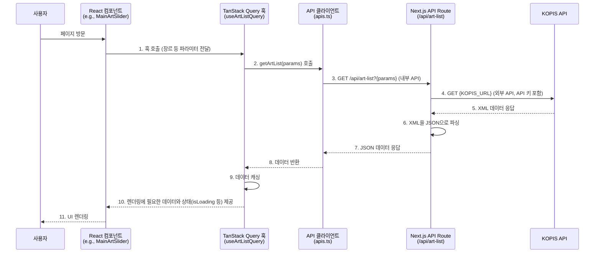

# Frontend Feature: Art

프론트엔드의 `art` 기능은 KOPIS(공연예술통합전산망) API를 통해 제공되는 공연 및 전시 정보를 사용자에게 시각적으로 매력적인 방식으로 탐색하고 조회할 수 있도록 하는 역할을 담당합니다.

## 1. 주요 파일 및 역할

-   **`features/art/apis.ts`**: KOPIS API를 호출하는 Next.js 서버의 내부 API Route (`/api/art-list`, `/api/art-detail/[id]`)와 통신하는 함수들을 정의합니다.
    -   `getArtList`: 장르, 공연 상태, 기간 등 다양한 필터 조건을 쿼리 파라미터로 조합하여 공연/전시 목록을 요청합니다.
    -   `getArtDetail`: 공연 ID를 받아 특정 공연의 상세 정보를 요청합니다.
-   **`features/art/queries.tsx`**: `apis.ts`의 함수들을 사용하여 공연/전시 데이터를 가져오는 TanStack Query 훅을 정의합니다.
    -   `useArtListQuery`: `getArtList`를 호출하여 공연 목록을 가져옵니다. API 응답 데이터는 `staleTime: Infinity`로 설정하여 한 번 가져온 목록은 다시 요청하지 않도록 캐싱 전략을 사용합니다.
    -   `useArtDetailQuery`: `getArtDetail`을 호출하여 특정 공연의 상세 정보를 가져옵니다. `staleTime`을 24시간으로 설정하여 하루 동안 캐시를 유지합니다.
-   **`features/art/constants.ts`**: API 요청에 사용되는 장르 코드, 도시 코드, 기본 요청 개수 등 관련 상수들을 정의합니다.
-   **`features/art/types.ts`**: KOPIS API 응답 데이터 구조에 기반한 TypeScript 타입(e.g., `ArtItem`, `ArtDetailItem`)을 정의합니다.
-   **`views/art-detail-view/index.tsx`**: 공연 상세 정보를 표시하는 페이지 UI 컴포넌트입니다. `useArtDetailQuery`를 사용해 데이터를 가져와 렌더링합니다.
-   **`features/art/components/art-slider/main-art-slider/index.tsx`**: 메인 페이지에 사용되는 공연 정보 슬라이더 컴포넌트입니다.
    -   장르별 칩(Chip) UI를 제공하며, 사용자가 칩을 선택하면 해당 장르의 데이터를 `useArtListQuery`로 다시 조회하여 동적으로 슬라이더 내용을 업데이트합니다.
    -   `Swiper.js` 라이브러리를 사용하여 인터랙티브한 슬라이더 UI를 구현합니다.

## 2. 데이터 흐름: 외부 API 연동

`art` 기능은 백엔드 DB를 거치지 않고, 프론트엔드 서버가 외부 API(KOPIS)를 직접 호출하여 데이터를 가져옵니다. 이는 API 키를 클라이언트에 노출시키지 않고 안전하게 데이터를 중계하기 위함입니다.

1.  **훅 호출**: 사용자가 페이지에 방문하면 `MainArtSlider`와 같은 컴포넌트가 렌더링되고, 내부적으로 `useArtListQuery` 훅이 특정 장르(e.g., "연극")를 파라미터로 하여 호출됩니다.
2.  **내부 API 요청**: `useArtListQuery`는 `getArtList` 함수를 실행합니다. 이 함수는 프론트엔드 서버에 정의된 `GET /api/art-list` API Route를 호출합니다.
3.  **외부 API 중계**: `/api/art-list` API Route는 서버 환경에서 실행되므로, 여기서 안전하게 `process.env.CULTURE_SERVICE_KEY`를 사용하여 KOPIS API에 실제 데이터 요청을 보냅니다.
4.  **데이터 파싱 및 반환**: KOPIS API로부터 받은 XML 형식의 응답을 JSON으로 파싱한 후, 클라이언트(브라우저)에 필요한 데이터만 담아 응답합니다.
5.  **캐싱 및 렌더링**: TanStack Query는 이 데이터를 캐시하고, 컴포넌트는 반환된 데이터를 사용하여 최종 UI를 렌더링합니다. 이후 동일한 장르의 목록을 다시 조회할 경우, 네트워크 요청 없이 캐시된 데이터를 즉시 사용합니다.
