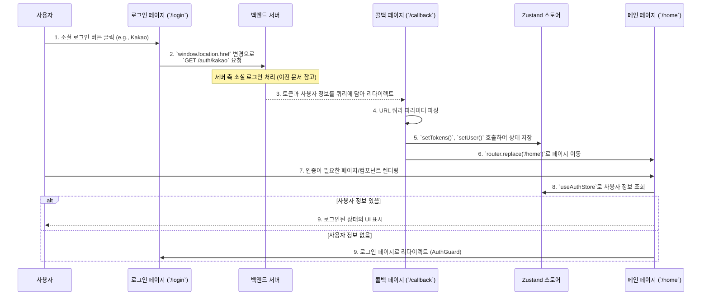

# Frontend Feature: Auth

프론트엔드의 `auth` 기능은 사용자 인증 상태를 관리하고, 인증 상태에 따라 특정 페이지에 대한 접근을 제어하는 역할을 합니다. 백엔드에서 발급받은 사용자 정보와 토큰을 클라이언트 측에서 안전하게 관리하고, 이를 기반으로 UI를 동적으로 변경합니다.

## 1. 주요 파일 및 역할

-   **`features/auth/store.ts`**: **Zustand**를 사용하여 인증 상태를 관리하는 스토어입니다.
    -   `user`: 로그인한 사용자 정보 객체.
    -   `accessToken`, `refreshToken`: 백엔드로부터 받은 JWT.
    -   `setUser`, `setTokens`, `clearAuth`: 상태를 변경하는 액션 함수.
    -   `persist` 미들웨어를 사용하여 인증 상태를 `localStorage`에 저장하여 브라우저를 새로고침해도 로그인 상태가 유지되도록 합니다.
-   **`features/auth/apis.ts`**: 인증 관련 API를 호출하는 함수가 정의되어 있습니다. `getUserProfile` 함수는 저장된 Access Token을 이용해 현재 로그인된 사용자의 프로필 정보를 백엔드로부터 가져옵니다.
-   **`features/auth/components/auth-guard.tsx`**: 인증된 사용자만 접근할 수 있는 페이지를 보호하는 **HOC (Higher-Order Component)** 입니다.
    -   `useAuthStore`를 통해 `user` 상태를 확인합니다.
    -   사용자 정보가 없으면(로그인하지 않은 상태) 로그인 페이지(`/login`)로 강제 리다이렉트합니다.
-   **`features/auth/components/guest-guard.tsx`**: 인증되지 않은 사용자만 접근해야 하는 페이지(e.g., 로그인 페이지)를 위한 HOC입니다.
    -   사용자 정보가 있으면(로그인한 상태) 메인 페이지(`/home`)로 리다이렉트합니다.
-   **`app/(auth)/login/page.tsx`**: 로그인 UI를 보여주는 페이지입니다. `guest-guard`로 감싸져 있습니다.
-   **`app/(auth)/callback/page.tsx`**: 소셜 로그인 후 백엔드 서버로부터 리다이렉트되는 콜백 페이지입니다. URL의 쿼리 파라미터로 전달된 `accessToken`, `refreshToken`, `user` 정보를 파싱하여 `useAuthStore`에 저장하고, 사용자를 홈 화면으로 이동시킵니다.

## 2. 핵심 로직 흐름

### 클라이언트 사이드 로그인 처리 흐름

사용자가 소셜 로그인 버튼을 클릭한 시점부터 프론트엔드에서 로그인 상태가 확립되기까지의 과정입니다.

1.  **로그인 시도**: 사용자가 로그인 페이지에서 '카카오 로그인' 버튼을 클릭합니다.
2.  **백엔드 요청**: `handleSocialLogin` 함수가 실행되어 `window.location.href`를 백엔드의 소셜 로그인 API 주소로 변경합니다.
3.  **콜백 처리**: 백엔드에서 모든 OAuth 인증 과정이 완료되면, Access/Refresh Token과 사용자 정보를 쿼리 스트링에 담아 프론트엔드의 `/callback` 페이지로 리다이렉트합니다.
4.  **상태 저장**: `/callback` 페이지에서는 `useSearchParams` 훅을 사용해 쿼리 파라미터를 읽어옵니다.
5.  **Zustand 스토어 업데이트**: 파싱한 토큰과 사용자 정보를 `useAuthStore`의 `setTokens`, `setUser` 액션을 호출하여 전역 상태 및 `localStorage`에 저장합니다.
6.  **페이지 이동**: 모든 상태 저장이 완료되면 `router.replace('/home')`을 통해 사용자를 메인 페이지로 이동시킵니다.
7.  **인증 기반 렌더링**: 이후 모든 페이지와 컴포넌트는 `useAuthStore`에서 사용자 정보를 가져와 로그인 여부를 판단하고, 그에 맞는 UI(e.g., 프로필 아이콘, 로그아웃 버튼)를 보여줍니다. `AuthGuard`로 보호되는 페이지는 접근이 가능해집니다.
