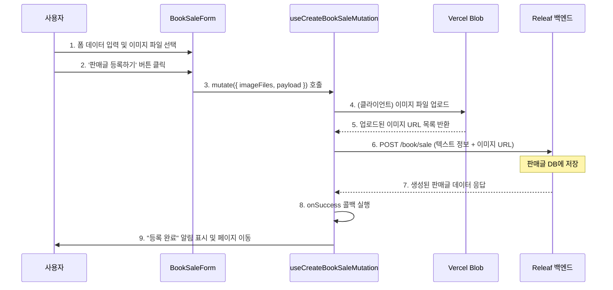
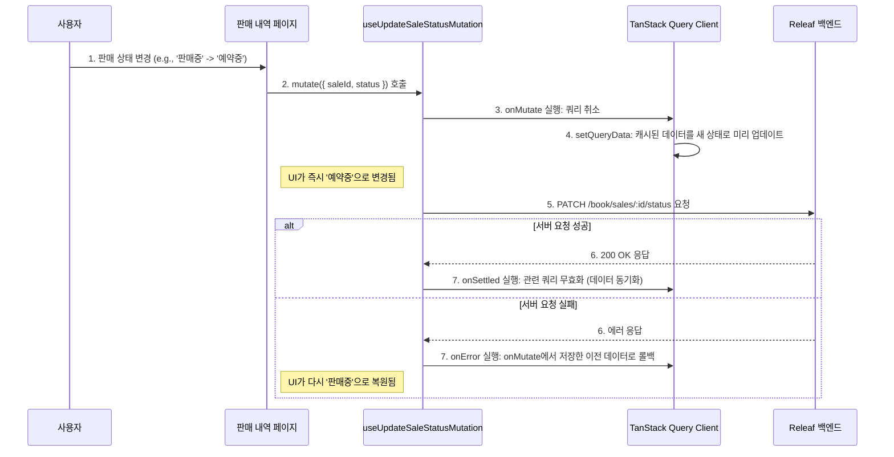

# Frontend Feature: Book

프론트엔드의 `book` 기능은 도서 정보 검색, 중고 서적 판매글 조회, 생성, 수정, 삭제 등 Releaf의 핵심적인 도서 관련 사용자 경험을 모두 담당합니다.

## 1. 주요 파일 및 역할

- **`features/book/apis.ts`**: 백엔드 `/book` 및 `/user` 엔드포인트와 통신하는 모든 API 요청 함수를 정의합니다. (e.g., `getBookList`, `createBookSale`, `getMyBookSales`)
- **`features/book/queries.tsx`**: `apis.ts`의 함수를 사용하여 TanStack Query 훅을 생성합니다. 데이터 캐싱, 서버 상태 동기화, 무한 스크롤 로직 등을 담당합니다.
  - `useBookDetailQuery`: ISBN으로 특정 책의 상세 정보를 조회합니다.
  - `useInfiniteBookSearch`: 검색어에 따라 도서 목록을 무한 스크롤로 조회합니다.
  - `useMyBookSalesQuery`: 내가 등록한 판매글 목록을 조회합니다.
- **`features/book/mutations.tsx`**: 데이터 생성/수정/삭제(CUD)를 위한 TanStack Query 뮤테이션 훅을 정의합니다.
  - `useCreateBookSaleMutation`: 판매글을 생성합니다. 이미지 업로드 로직을 포함합니다.
  - `useUpdateBookSaleStatusMutation`: 판매글의 상태(판매중, 예약중, 판매완료)를 변경합니다. **낙관적 업데이트(Optimistic Update)**를 적용하여 빠른 UI 반응성을 제공합니다.
  - `useDeleteBookSaleMutation`: 판매글과 연결된 이미지를 함께 삭제합니다.
- **`features/book/stores/`**: 도서 관련 클라이언트 상태를 관리하는 Zustand 스토어입니다.
  - `useBookSearchStore`: 도서 검색 페이지의 검색어(`query`) 상태를 관리합니다.
  - `useRecentBookStore`: 최근 본 책 목록을 `sessionStorage`에 저장하고 관리합니다.
- **`views/`**: `book` 기능과 관련된 주요 페이지 UI 컴포넌트입니다.
  - `book-search-view`: 도서 검색 페이지 UI.
  - `book-detail-view`: 도서 상세 정보 및 관련 판매글 목록 UI.
  - `book-sale-form-view`: 중고 서적 판매글 작성 폼 UI.
  - `book-market-view`: 중고 서적 마켓 목록 및 필터링 UI.
- **`features/book/actions/`**: Next.js 서버 액션(Server Actions)을 정의합니다.
  - `upload-action.ts`: Vercel Blob 스토리지에 이미지를 업로드합니다.
  - `delete-action.ts`: Vercel Blob 스토리지에서 이미지를 삭제합니다.

## 2. 데이터 흐름 및 핵심 로직

### 중고 서적 판매글 생성 (이미지 업로드 포함)

사용자가 판매글 폼을 작성하고 제출하면, 클라이언트(브라우저)에서 직접 이미지를 Vercel Blob에 업로드한 후, 반환된 이미지 URL을 포함하여 백엔드에 최종 데이터를 전송합니다. 이를 통해 백엔드 서버의 파일 처리 부담을 줄입니다.

1.  **폼 제출**: 사용자가 `BookSaleForm`에서 모든 정보를 입력하고 '판매글 등록하기' 버튼을 클릭합니다.
2.  **뮤테이션 호출**: `useCreateBookSaleMutation`의 `mutate` 함수가 `imageFiles`(File 객체 배열)와 `payload`(텍스트 데이터)를 인자로 받아 호출됩니다.
3.  **이미지 업로드**: 뮤테이션 함수 내부에서 `@vercel/blob/client`의 `upload` 함수를 호출하여 클라이언트 측에서 직접 이미지 파일들을 Vercel Blob 스토리지로 전송합니다.
4.  **백엔드 요청**: 이미지 업로드가 완료되고 URL 목록을 받으면, 이 URL들을 `payload`에 포함시켜 백엔드의 `POST /book/sale` API로 최종 데이터를 전송합니다.
5.  **성공 처리**: 백엔드에서 성공 응답을 받으면, `onSuccess` 콜백이 실행되어 사용자에게 성공 알림을 보여주고 '나의 판매 내역' 페이지로 이동시킵니다.

### 판매 상태 변경 (낙관적 업데이트)

사용자가 '나의 판매 내역' 페이지에서 판매 상태를 변경하면, 서버 응답을 기다리지 않고 즉시 UI를 업데이트하여 사용자 경험을 향상시킵니다.

1.  **상태 변경**: 사용자가 드롭다운 메뉴를 통해 특정 판매글의 상태를 변경합니다.
2.  **`onMutate` 실행**: `useUpdateBookSaleStatusMutation`의 `mutate` 함수가 호출되면, 실제 API 요청을 보내기 전에 `onMutate` 콜백이 먼저 실행됩니다.
3.  **UI 즉시 업데이트**: `onMutate` 내에서 `queryClient.setQueryData`를 사용하여 TanStack Query에 캐시된 데이터를 즉시 새로운 상태로 변경합니다. 이로 인해 UI는 서버 응답 없이 바로 업데이트됩니다.
4.  **서버 요청 및 결과 처리**:
    - **성공 시**: API 요청이 성공하면 `onSettled` 콜백이 실행되어 관련 쿼리를 무효화(invalidate)함으로써 서버와 클라이언트의 데이터를 최신 상태로 동기화합니다.
    - **실패 시**: API 요청이 실패하면 `onError` 콜백이 실행되어, `onMutate` 단계에서 백업해 둔 이전 데이터로 쿼리 캐시를 되돌립니다(롤백). UI 또한 원래 상태로 복원됩니다.
