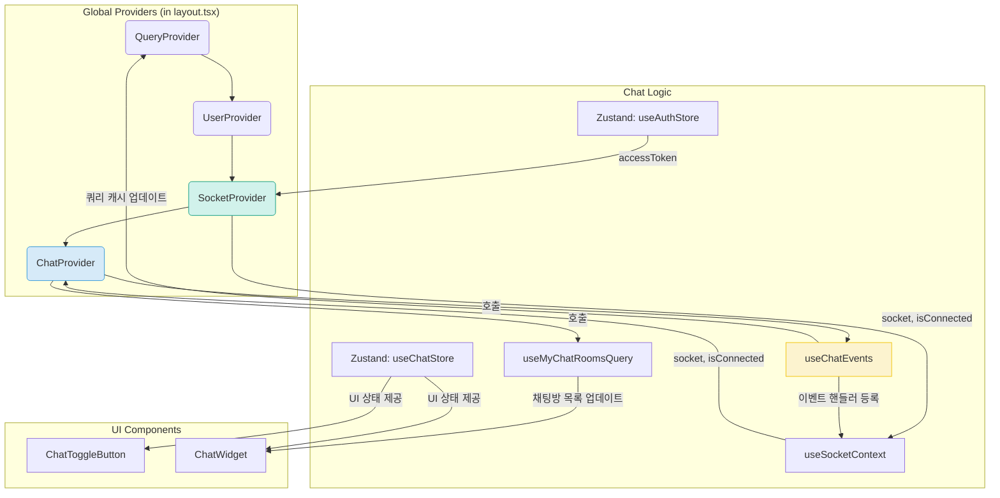
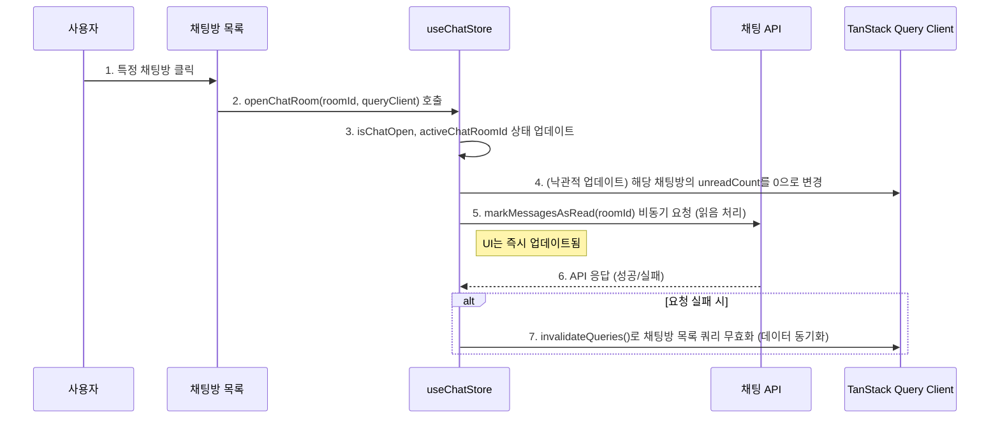

# Frontend Feature: Chat

프론트엔드의 `chat` 기능은 사용자 간의 실시간 양방향 통신을 구현합니다. 전역적으로 접근 가능한 채팅 위젯을 통해 어느 페이지에서든 대화를 이어갈 수 있는 사용자 경험을 제공합니다.

## 1. 아키텍처 및 주요 파일

채팅 기능은 여러 Provider와 컴포넌트, 훅, 스토어가 유기적으로 결합하여 동작합니다.

-   **`shared/providers/socket-provider.tsx`**:
    -   **역할**: 웹소켓 연결의 생명주기를 관리하는 최하위 Provider입니다.
    -   **로직**: `useAuthStore`에서 Access Token을 가져와, 토큰이 있을 경우에만 Socket.IO 클라이언트 인스턴스를 생성하고 서버의 `/chat` 네임스페이스에 연결을 시도합니다. Access Token이 변경되거나 없어지면 기존 연결을 끊고 새로 연결합니다.
    -   `useSocketContext` 훅을 통해 하위 컴포넌트에 `socket` 인스턴스와 연결 상태(`isConnected`)를 제공합니다.

-   **`shared/providers/chat-provider.tsx`**:
    -   **역할**: `SocketProvider` 위에서 실제 채팅 기능의 이벤트 리스너를 등록하고, 채팅방에 입장하는 등 채팅 관련 로직을 총괄하는 Provider입니다.
    -   **로직**:
        1.  사용자가 로그인하고 소켓이 연결되면 `useChatEvents` 훅을 통해 소켓 이벤트 리스너(`newMessage`, `newChatRoom` 등)를 등록합니다.
        2.  `useMyChatRoomsQuery`로 채팅방 목록을 가져온 후, `hasJoinedRooms` 상태를 확인하여 아직 참여하지 않은 방이 있으면 `joinRooms` 이벤트를 서버로 보내 한 번에 모든 방에 참여(subscribe)합니다.

-   **`features/chat/hooks/use-chat-events.ts`**:
    -   **역할**: 서버로부터 오는 각종 웹소켓 이벤트를 수신하고, 그에 따라 TanStack Query 캐시를 업데이트하는 로직을 모아놓은 커스텀 훅입니다.
    -   **로직**: `newMessage` 이벤트를 받으면 `queryClient.setQueryData`를 사용해 해당 채팅방의 메시지 목록 캐시를 수동으로 업데이트하여 실시간으로 메시지가 보이는 것처럼 처리합니다. 또한 채팅방 목록의 마지막 메시지와 안 읽은 개수도 업데이트합니다.

-   **`features/chat/stores/use-chat-store.ts`**:
    -   **역할**: 채팅 위젯의 UI 상태를 관리하는 Zustand 스토어입니다.
    -   **상태**: `isChatOpen`(위젯 열림/닫힘), `activeChatRoomId`(현재 열려있는 채팅방 ID), `typingUsers`(입력 중인 사용자 정보) 등을 관리합니다.

-   **`features/chat/components/`**:
    -   `chat-widget.tsx`: 채팅 위젯의 전체적인 레이아웃을 담당하며, `activeChatRoomId` 상태에 따라 `ChatList` 또는 `ChatRoom` 컴포넌트를 조건부 렌더링합니다.
    -   `chat-list.tsx`: `useMyChatRoomsQuery` 훅을 사용해 채팅방 목록을 가져와 렌더링합니다.
    -   `chat-room.tsx`: `useInfiniteChatMessagesQuery` 훅으로 메시지 목록을 가져와 무한 스크롤로 보여주며, `sendMessage` 이벤트를 통해 메시지를 전송합니다.

## 2. 핵심 로직 흐름

### 채팅 위젯 초기화 및 메시지 수신

사용자가 로그인했을 때 채팅 기능이 활성화되고 실시간으로 메시지를 받기까지의 과정입니다.

1.  **소켓 연결**: `SocketProvider`가 `useAuthStore`의 `accessToken`을 감지하고, 토큰이 존재하면 웹소켓 서버에 연결을 시도합니다.
2.  **이벤트 리스너 등록**: `ChatProvider`는 소켓 연결이 성공하면(`isConnected: true`), `useChatEvents` 훅을 통해 `newMessage`, `typing` 등 서버에서 보낼 이벤트를 처리할 핸들러들을 등록합니다.
3.  **채팅방 입장**: `ChatProvider`는 `useMyChatRoomsQuery`를 통해 사용자의 전체 채팅방 목록을 가져온 후, 이 목록을 기반으로 `socket.emit('joinRooms', ...)`를 호출하여 서버에게 해당 방들로부터 메시지를 구독하겠다고 알립니다.
4.  **실시간 업데이트**: 이후 다른 사용자가 메시지를 보내면, 서버는 `newMessage` 이벤트를 보냅니다. `useChatEvents`의 핸들러가 이 이벤트를 감지하고, `queryClient.setQueryData`를 사용해 TanStack Query의 캐시를 직접 업데이트하여 화면에 즉시 새로운 메시지가 표시됩니다.

### 채팅방 열기 및 메시지 읽음 처리

1.  **채팅방 열기**: 사용자가 `ChatList` 컴포넌트에서 특정 채팅방을 클릭합니다.
2.  **`openChatRoom` 호출**: `useChatStore`의 `openChatRoom` 액션이 호출됩니다.
3.  **UI 즉시 업데이트**:
    -   `activeChatRoomId` 상태가 변경되어 `ChatWidget`은 `ChatRoom` 컴포넌트를 렌더링합니다.
    -   동시에 `markRoomAsRead`가 호출되어, TanStack Query 캐시의 `unreadCount`를 즉시 0으로 업데이트하여 UI에서 안 읽음 배지가 사라집니다(낙관적 업데이트).
4.  **서버 요청**: 백그라운드에서 실제 `PATCH /chat/rooms/:roomId/read` API를 호출하여 서버에 읽음 상태를 기록합니다. 요청이 실패할 경우, 쿼리를 무효화하여 서버의 최신 데이터와 동기화합니다.

이처럼 채팅 기능은 **TanStack Query**를 통한 서버 데이터 관리, **Zustand**를 통한 UI 상태 관리, 그리고 **Socket.IO**를 통한 실시간 통신이 유기적으로 결합되어 구현되었습니다.
