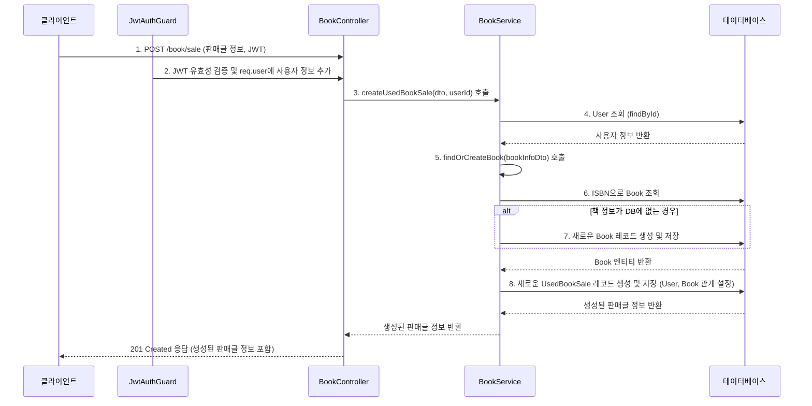

# Book Module (`features/book`)

`BookModule`은 도서 정보(마스터 데이터)와 중고 서적 판매 게시글에 관련된 모든 기능을 담당합니다. 사용자는 이 모듈을 통해 판매글을 생성, 조회, 수정, 삭제할 수 있습니다.

## 1. 주요 파일 및 역할

-   **`book.controller.ts`**: `/book` 경로의 API 엔드포인트를 정의합니다. 중고 서적 판매글의 CRUD(생성, 조회, 수정, 삭제)와 판매 상태 변경, 검색 등 클라이언트의 모든 요청을 받아 적절한 서비스로 전달합니다.
-   **`book.service.ts`**: 도서 및 판매글 관련 핵심 비즈니스 로직을 수행합니다.
    -   `findOrCreateBook`: 판매글 생성 시, 해당 책이 데이터베이스에 없으면 새로 등록하고, 있으면 기존 정보를 반환하여 데이터 중복을 방지합니다.
    -   `createUsedBookSale`: 판매글 생성 요청을 처리합니다.
    -   `searchSales`: 다양한 조건(검색어, 지역, 가격, 상태 등)에 따라 판매글을 필터링하고 정렬하여 반환합니다.
    -   기타 CRUD 및 상태 변경 로직을 담당합니다.
-   **`entities/book.entity.ts`**: 도서의 마스터 정보를 담는 TypeORM 엔티티입니다. `isbn`을 Primary Key로 사용합니다.
-   **`entities/used-book-sale.entity.ts`**: 중고 서적 판매글 정보를 담는 TypeORM 엔티티입니다. `User` 및 `Book` 엔티티와 관계를 맺고 있습니다.
-   **`dtos/`**: 데이터 전송 객체(DTO) 파일들이 위치합니다.
    -   `create-book-sale.dto.ts`: 판매글 생성 시 클라이언트가 보내야 할 데이터의 형식을 정의합니다.
    -   `update-book-sale.dto.ts`: 판매글 수정 시 사용하는 DTO입니다.
    -   `query-book-sale.dto.ts`: 판매글 목록 조회 시 사용될 수 있는 다양한 쿼리 파라미터(검색, 필터링, 정렬)를 정의합니다.

## 2. API 엔드포인트

| HTTP Method | 경로 (`/book/...`)       | 설명                                      | 인증 필요       |
| :---------- | :----------------------- | :---------------------------------------- | :-------------- |
| `POST`      | `/sale`                  | 새로운 중고 서적 판매글을 생성합니다.     | ✅ (Access Token) |
| `GET`       | `/sales`                 | 조건에 따라 판매글 목록을 검색/조회합니다.| ❌              |
| `GET`       | `/sales/recent`          | 최근 등록된 판매글 목록을 조회합니다.     | ❌              |
| `GET`       | `/sales/:id`             | 특정 판매글의 상세 정보를 조회합니다.     | ❌              |
| `PATCH`     | `/sales/:id`             | 특정 판매글의 정보를 수정합니다.          | ✅ (Access Token) |
| `DELETE`    | `/sales/:id`             | 특정 판매글을 삭제합니다.                 | ✅ (Access Token) |
| `PATCH`     | `/sales/:id/status`      | 특정 판매글의 판매 상태를 변경합니다.     | ✅ (Access-Token) |
| `GET`       | `/:isbn/sales`           | 특정 도서(ISBN)에 대한 판매글 목록을 조회합니다. | ❌ |

## 3. 엔티티 스키마

### 3.1. `Book` (도서 마스터)

| 컬럼명 | 타입 | 설명 |
| :--- | :--- | :--- |
| `isbn` | `string` | 도서 ISBN (Primary Key) |
| `title`| `string` | 제목 |
| `author` | `string` | 저자 |
| `publisher`|`string`| 출판사 |
| `description`|`string`| 설명 |
| `image`| `string` | 표지 이미지 URL |

### 3.2. `UsedBookSale` (중고 서적 판매글)

| 컬럼명 | 타입 | 설명 |
| :--- | :--- | :--- |
| `id` | `number` | 판매글 고유 ID (Primary Key) |
| `title`| `string` | 판매글 제목 |
| `price`| `number` | 판매 가격 |
| `city` | `string` | 거래 지역 (시/도) |
| `district`|`string`| 거래 지역 (시/군/구) |
| `content`| `string` | 상세 설명 |
| `imageUrls`| `string[]`| 판매자가 등록한 책 상태 이미지 URL 목록 |
| `status` | `SaleStatus` | 판매 상태 (`FOR_SALE`, `RESERVED`, `SOLD`) |
| `user` | `User` | 판매자 (User 엔티티와 N:1 관계) |
| `book` | `Book` | 판매 대상 도서 (Book 엔티티와 N:1 관계) |

## 4. 핵심 로직 흐름

### 중고 서적 판매글 생성

사용자가 새로운 중고 서적 판매글을 등록하는 과정입니다. 이 과정에서 도서 마스터 데이터의 중복을 방지하는 로직이 포함됩니다.

1.  **API 요청**: 클라이언트는 JWT와 함께 판매글 정보를 담아 `POST /book/sale` API를 요청합니다.
2.  **사용자 인증**: `JwtAuthGuard`가 요청을 가로채 Access Token을 검증하고, 유효한 경우 `req.user`에 사용자 정보를 담아 컨트롤러로 전달합니다.
3.  **서비스 호출**: `BookController`는 `@CurrentUser` 데코레이터로 사용자 정보를 가져와 `BookService.createUsedBookSale()` 메서드를 호출합니다.
4.  **`findOrCreateBook`**: `BookService` 내부적으로 `findOrCreateBook` 메서드를 호출합니다.
    -   요청에 포함된 책의 ISBN으로 `books` 테이블을 조회합니다.
    -   해당 ISBN의 책이 존재하면 그 정보를 사용하고, 없으면 새로운 레코드를 생성하여 중복 저장을 방지합니다.
5.  **판매글 생성**: `User`와 `Book` 엔티티 정보를 포함하여 `used_book_sales` 테이블에 새로운 판매글 레코드를 생성하고 저장합니다.
6.  **응답**: 생성된 판매글 정보를 클라이언트에 반환합니다.
