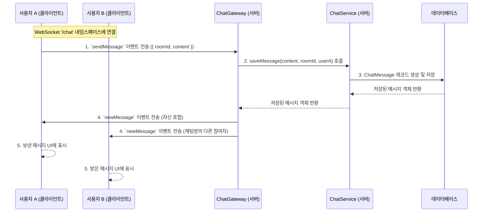

# Chat Module (`features/chat`)

`ChatModule`은 중고 서적 거래를 위한 사용자 간의 실시간 채팅 기능을 제공합니다. WebSocket을 기반으로 메시지를 실시간으로 주고받으며, 채팅방 관리 및 메시지 조회를 위한 REST API도 함께 제공합니다.

## 1. 아키텍처: REST API + WebSocket

채팅 기능은 HTTP 기반의 REST API와 WebSocket 기반의 실시간 통신, 두 가지 방식으로 구현됩니다.

-   **REST API (`ChatController`)**: 채팅방 목록 조회, 이전 메시지 불러오기, 채팅방 생성 등 상태를 조회하거나 생성하는 단발성 작업에 사용됩니다.
-   **WebSocket (`ChatGateway`)**: 실시간 메시지 송수신, 상대방의 입력 상태 알림, 사용자 접속 상태 관리 등 지속적인 양방향 통신이 필요한 기능에 사용됩니다.

## 2. 주요 파일 및 역할

-   **`chat.controller.ts`**: `/chat` 경로의 REST API 엔드포인트를 정의합니다. 채팅방 목록, 이전 메시지 조회, 채팅방 생성/나가기 등의 기능을 제공합니다.
-   **`chat.gateway.ts`**: `@WebSocketGateway` 데코레이터를 사용하여 웹소켓 서버를 구현합니다. 클라이언트와의 연결 수립/종료, 메시지 수신 및 브로드캐스팅, 특정 `room`으로의 이벤트 전송 등을 담당합니다.
-   **`chat.service.ts`**: 채팅 관련 핵심 비즈니스 로직을 처리합니다.
    -   `getChatRoom`: 판매글 ID와 구매자 ID를 받아 기존 채팅방을 찾거나, 없으면 새로 생성하여 반환합니다.
    -   `getChatRooms`: 특정 사용자가 참여 중인 모든 채팅방 목록과 각 방의 마지막 메시지, 안 읽은 메시지 수를 조회합니다.
    -   `saveMessage`: 받은 메시지를 데이터베이스에 저장합니다.
    -   `markMessagesAsRead`: 특정 채팅방의 메시지를 읽음 처리합니다.
-   **`guards/socket-auth.guard.ts`**: 웹소켓 연결 요청이 들어올 때, 클라이언트가 보낸 JWT를 검증하여 인가된 사용자인지 확인하는 가드입니다. 유효하지 않은 사용자의 연결은 차단합니다.
-   **`entities/`**: 채팅 관련 데이터베이스 테이블 스키마를 정의합니다.
    -   `chat-room.entity.ts`: 채팅방 정보를 담는 엔티티. `UsedBookSale`과 관계를 맺습니다.
    -   `chat-participant.entity.ts`: 어떤 `User`가 어떤 `ChatRoom`에 참여하고 있는지 나타내는 중간 테이블 엔티티.
    -   `chat-message.entity.ts`: 채팅 메시지의 내용, 보낸 사람, 보낸 시각 등을 담는 엔티티.

## 3. API 및 WebSocket 이벤트 명세

### 3.1. REST API Endpoints

| HTTP Method | 경로 (`/chat/...`)             | 설명                                           | 인증 필요       |
| :---------- | :----------------------------- | :--------------------------------------------- | :-------------- |
| `POST`      | `/rooms`                       | 특정 판매글에 대한 채팅방을 생성하거나 조회합니다. | ✅ (Access Token) |
| `GET`       | `/rooms`                       | 내가 참여 중인 모든 채팅방 목록을 조회합니다.  | ✅ (Access Token) |
| `GET`       | `/rooms/:roomId/messages`      | 특정 채팅방의 이전 메시지들을 조회합니다. (페이지네이션) | ✅ (Access Token) |
| `PATCH`     | `/rooms/:roomId/read`          | 특정 채팅방의 메시지를 모두 읽음 처리합니다.     | ✅ (Access Token) |
| `DELETE`    | `/rooms/:roomId`               | 특정 채팅방에서 나갑니다.                      | ✅ (Access Token) |

### 3.2. WebSocket Events (`/chat` 네임스페이스)

-   **서버 수신 이벤트 (Client -> Server)**
    | 이벤트명      | 데이터 (`data`)               | 설명                                   |
    | :------------ | :---------------------------- | :------------------------------------- |
    | `sendMessage` | `{ roomId: number, content: string }` | 특정 채팅방으로 메시지를 전송합니다.   |
    | `joinRooms`   | `number[]` (roomIds)          | 클라이언트가 여러 채팅방에 한번에 join합니다. |
    | `leaveRoom`   | `{ roomId: number }`          | 특정 채팅방에서 나갑니다.              |
    | `startTyping` | `{ roomId: number }`          | 상대방에게 입력 중 상태를 알립니다.    |
    | `stopTyping`  | `{ roomId: number }`          | 상대방에게 입력 중 상태가 끝났음을 알립니다. |

-   **서버 발신 이벤트 (Server -> Client)**
    | 이벤트명      | 데이터 (`data`)                      | 설명                                      |
    | :------------ | :----------------------------------- | :---------------------------------------- |
    | `connected`   | `{ message: string }`                | 서버에 성공적으로 연결되었을 때 받습니다. |
    | `newChatRoom` | `ChatRoom` 객체                      | 내가 참여하는 새로운 채팅방이 생성되었을 때 받습니다. |
    | `newMessage`  | `ChatMessage` 객체                   | 새로운 메시지를 수신했을 때 받습니다.     |
    | `userLeft`    | `{ roomId: number, message: ChatMessage }` | 상대방이 채팅방을 나갔을 때 시스템 메시지와 함께 받습니다. |
    | `userRejoined`| `{ roomId: number, message: ChatMessage }` | 나갔던 사용자가 다시 채팅방에 참여했을 때 시스템 메시지와 함께 받습니다. |
    | `typing`      | `{ nickname: string, isTyping: boolean }` | 상대방의 입력 상태를 전달받습니다.        |
    | `error`       | `WsException` 객체                   | 인증 실패 등 에러 발생 시 받습니다.       |

## 4. 핵심 로직 흐름

### 채팅 메시지 송수신

1.  **메시지 전송**: 사용자 A가 특정 채팅방(`roomId`)에 메시지(`content`)를 입력하고 전송하면, 클라이언트는 `sendMessage` 이벤트를 웹소켓 서버로 보냅니다.
2.  **메시지 저장**: `ChatGateway`는 이벤트를 수신하여 `ChatService.saveMessage()`를 호출합니다. 서비스는 받은 메시지를 데이터베이스에 저장합니다.
3.  **브로드캐스팅**: 메시지가 성공적으로 저장되면, `ChatGateway`는 해당 `roomId`를 구독하고 있는 모든 클라이언트(자기 자신 포함)에게 `newMessage` 이벤트를 통해 저장된 메시지 객체를 브로드캐스팅합니다.
4.  **UI 업데이트**: `newMessage` 이벤트를 수신한 모든 클라이언트는 채팅창에 새로운 메시지를 렌더링합니다.
