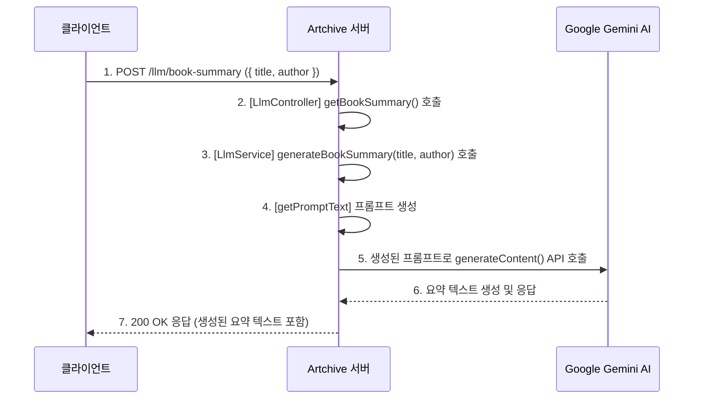

# LLM Module (`features/llm`)

`LlmModule`은 Google의 Generative AI (Gemini) 모델을 사용하여 AI 기반 기능을 제공하는 역할을 합니다. 현재는 도서의 제목과 저자 정보를 바탕으로 책의 핵심 내용 요약 및 추천 대상 분석 기능을 제공합니다.

## 1. 주요 파일 및 역할

-   **`llm.controller.ts`**: `/llm` 경로의 API 엔드포인트를 정의합니다. 클라이언트로부터 책 요약 생성 요청을 받아 `LlmService`로 전달합니다.
-   **`llm.service.ts`**: AI 모델과의 상호작용을 담당하는 핵심 서비스입니다.
    -   `@google/generative-ai` SDK를 사용하여 Gemini 모델을 초기화합니다.
    -   `generateBookSummary()`: 요청받은 책 정보와 사전 정의된 프롬프트를 조합하여 AI 모델에 질의하고, 생성된 텍스트를 반환합니다.
-   **`dtos/book-summary.dto.ts`**: 책 요약 요청 시 클라이언트가 보내야 할 데이터 형식( `title`, `author`)을 정의하고 유효성을 검증합니다.
-   **`constants/index.ts`**: 사용할 AI 모델의 이름(`gemini-2.5-pro`)과 같은 상수를 정의합니다.
-   **`utils/get-prompt-text.ts`**: AI 모델에 보낼 프롬프트 텍스트를 생성하는 유틸리티 함수입니다. 프롬프트 내용을 한 곳에서 관리하여 일관성을 유지하고 수정을 용이하게 합니다.

## 2. API 엔드포인트

| HTTP Method | 경로 (`/llm/...`) | 설명                                 | 인증 필요 |
| :---------- | :---------------- | :----------------------------------- | :-------- |
| `POST`      | `/book-summary`   | AI를 이용해 책 요약 및 분석을 생성합니다. | ❌         |

## 3. 핵심 로직 흐름

### AI 책 요약 생성

클라이언트가 특정 책에 대한 AI 요약을 요청하면, 백엔드는 Google Gemini API와 통신하여 결과를 받아 반환합니다.

1.  **API 요청**: 클라이언트가 책 제목(`title`)과 저자(`author`) 정보를 담아 `POST /llm/book-summary` API를 호출합니다.
2.  **서비스 호출**: `LlmController`는 요청 데이터를 받아 `LlmService.generateBookSummary()` 메서드를 호출합니다.
3.  **프롬프트 생성**: `LlmService`는 `getPromptText` 유틸리티 함수를 사용해 AI 모델에 최적화된 프롬프트 문자열을 생성합니다.
4.  **AI 모델 호출**: 서비스는 `@google/generative-ai` SDK를 통해 미리 초기화된 Gemini 모델의 `generateContent()` 메서드를 호출하여 AI에게 요약 생성을 요청합니다.
5.  **결과 반환**: AI 모델이 생성한 텍스트를 응답으로 받아, 해당 텍스트를 클라이언트에게 최종적으로 반환합니다.

이러한 구조를 통해 AI 모델과 관련된 로직(프롬프트 엔지니어링, API 키 관리, SDK 사용법 등)을 `LlmModule` 내에 캡슐화하여 다른 비즈니스 로직과의 분리를 명확히 합니다.
