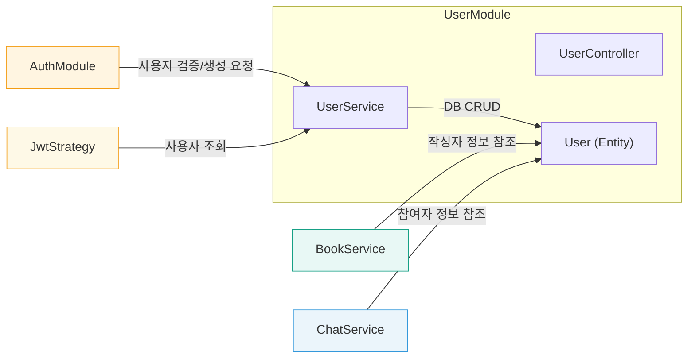

# User Module (`features/user`)

`UserModule`은 Artchive 서비스의 사용자 계정 정보와 관련된 모든 데이터 및 비즈니스 로직을 관리하는 모듈입니다.

## 1. 주요 파일 및 역할

-   **`user.controller.ts`**: `/user` 경로의 API 엔드포인트를 정의합니다. 클라이언트가 사용자 프로필 정보나 자신이 등록한 판매글 목록을 요청할 때 사용됩니다.
-   **`user.service.ts`**: 사용자 관련 비즈니스 로직을 처리합니다. 데이터베이스와 직접 상호작용하여 사용자를 조회, 생성, 수정하는 역할을 합니다. `AuthModule`에서 소셜 로그인 시 사용자를 검증하는 데 사용되기도 합니다.
-   **`user.entity.ts`**: 데이터베이스의 `users` 테이블 스키마를 정의하는 TypeORM 엔티티입니다. 사용자의 핵심 정보를 담고 있으며, 다른 엔티티(판매글, 채팅 등)와의 관계를 정의합니다.
-   **`decorators/current-user.decorator.ts`**: 요청(request) 객체에 담긴 사용자 정보(`req.user`)를 컨트롤러에서 `@CurrentUser()` 데코레이터만으로 쉽게 가져올 수 있도록 하는 커스텀 데코레이터입니다.
-   **`dtos/`**: 사용자 관련 데이터 전송 객체(DTO)를 정의합니다. 예를 들어, `update-sale-status.dto.ts`는 판매글 상태 업데이트 시 필요한 데이터 형식을 정의합니다. (실제로는 `Book` 도메인과 더 관련이 깊을 수 있습니다.)

## 2. API 엔드포인트

| HTTP Method | 경로 (`/user/...`) | 설명                                  | 인증 필요 |
| :---------- | :----------------- | :------------------------------------ | :-------- |
| `GET`       | `/profile`         | 현재 로그인된 사용자의 프로필 정보를 조회합니다. | ✅ (Access Token) |
| `GET`       | `/my-sales`        | 현재 로그인된 사용자가 등록한 모든 판매글을 조회합니다. | ✅ (Access Token) |

## 3. `User` 엔티티 스키마

`user.entity.ts` 파일은 데이터베이스의 `users` 테이블 구조를 정의합니다.

| 컬럼명 (`@Column`) | 타입             | 설명                                        | 비고 (관계, 제약조건 등) |
| :----------------- | :--------------- | :------------------------------------------ | :----------------------- |
| `id`               | `number`         | 사용자의 고유 ID (Primary Key)              | `@PrimaryGeneratedColumn` |
| `provider`         | `string`         | 소셜 로그인 제공자 (e.g., "naver", "kakao") |                          |
| `providerId`       | `string`         | 소셜 플랫폼에서의 고유 ID                   |                          |
| `email`            | `string` (nullable) | 사용자 이메일                               | `@Unique()`              |
| `nickname`         | `string`         | 사용자 닉네임                               |                          |
| `profileImageUrl`  | `string` (nullable) | 프로필 이미지 URL                           |                          |
| `createdAt`        | `Date`           | 계정 생성일                                 | `@CreateDateColumn`      |
| `updatedAt`        | `Date`           | 계정 정보 수정일                            | `@UpdateDateColumn`      |

### 관계 (Relations)

-   **`usedBookSales`**: `UsedBookSale` 엔티티와 1:N 관계. 한 명의 사용자는 여러 개의 중고 서적 판매글을 가질 수 있습니다.
-   **`chatParticipants`**: `ChatParticipant` 엔티티와 1:N 관계. 사용자가 참여하고 있는 채팅방 목록을 나타냅니다.
-   **`readReceipts`**: `ReadReceipt` 엔티티와 1:N 관계. 사용자가 읽은 메시지 기록을 나타냅니다.

## 4. 모듈 간의 상호작용

`UserModule`은 다른 모듈과 긴밀하게 상호작용합니다.

-   **`AuthModule` -> `UserService`**: 소셜 로그인 시 `AuthService`는 `UserService.findByProviderId()`를 호출하여 기존 사용자인지 확인하고, `UserService.createUser()`를 통해 신규 사용자를 생성합니다.
-   **`JwtStrategy` -> `UserService`**: API 요청 시 JWT 페이로드에 담긴 사용자 ID(`sub`)를 이용해 `UserService.findById()`를 호출하여 유효한 사용자인지 검증합니다.
-   **다른 모듈 -> `UserEntity`**: `BookModule`, `ChatModule` 등 다른 모듈에서는 판매글의 작성자 정보나 채팅 참여자 정보를 참조하기 위해 `User` 엔티티와 관계를 맺습니다.
